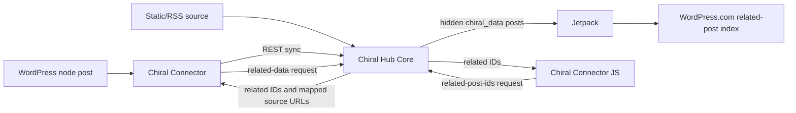

# Chiral Hub Core

[中文文档](./README.zh-CN.md)

Turn a WordPress site into the hub of a Chiral Network: a federated related-post network for independent blogs.

Chiral Hub Core is the server-side WordPress plugin in the WP Chiral Network ecosystem. It receives article metadata from connected sites, stores that metadata as hidden `chiral_data` posts, lets Jetpack sync those posts to WordPress.com, and exposes REST endpoints that return cross-site related content to WordPress and static-site clients.

The project follows the idea described on the [WP Chiral Network site](https://ckc.akashio.com/): independent blogs should be able to build their own content discovery network without becoming dependent on a centralized content platform.

## Ecosystem

| Project | Role | Typical install target |
| --- | --- | --- |
| Chiral Hub Core | Network hub, article metadata store, Jetpack/WordPress.com bridge | The WordPress site that operates the network |
| [Chiral Connector](https://github.com/Pls-1q43/Chiral-Connector) | WordPress node plugin that syncs posts and displays related posts | Member WordPress blogs |
| [Chiral Connector JS](https://github.com/Pls-1q43/Chiral-Connector-JS) | Display-only client for static blogs | Hugo, Jekyll, Hexo, VuePress, and similar sites |

## What It Does

| Area | Capability |
| --- | --- |
| Network hub | Converts a WordPress site into the central Chiral Hub for connected nodes. |
| Data model | Stores synchronized content as the `chiral_data` custom post type, with source URL, original post ID, node ID, featured image URL, tags, categories, and sync metadata. |
| Related posts | Uses Jetpack and WordPress.com related-post infrastructure instead of calculating relevance on the Hub server. |
| Node access | Provides a restricted `chiral_porter` role for authenticated node access. |
| REST API | Provides endpoints for connection checks, related-data lookup, and related-post ID lookup. |
| Review policy | Lets the Hub decide whether incoming content is published directly or held for review. |
| Static sources | Includes RSS/Sitemap crawling support used by non-WordPress sources and the JS client workflow. |
| SEO safety | Keeps aggregated `chiral_data` content out of normal public search flows while preserving it for related-post indexing. |

## Requirements

- WordPress 5.2 or later.
- PHP 7.2 or later.
- Jetpack installed, active, connected to WordPress.com, and ready to sync related-post data.
- A public Hub URL reachable by connected Chiral Connector or JS clients.

## Quick Start

1. Install Chiral Hub Core on the WordPress site that will operate the network.
2. Install and connect Jetpack, then make sure the Related Posts module is available.
3. Open the WordPress admin menu for Chiral Hub and set the network name, review policy, default related-post count, and transfer mode if needed.
4. For each WordPress node, create or approve a user with the `chiral_porter` role, set a unique node ID, and generate a WordPress Application Password for that user.
5. Give the node operator the Hub URL, Porter username, and Application Password so they can configure Chiral Connector.
6. Check the Hub dashboard after the first sync. Incoming content should appear as `chiral_data` posts and then become available to Jetpack/WordPress.com for related-post matching.

## REST API Surface

The plugin exposes these main endpoints:

| Endpoint | Purpose |
| --- | --- |
| `/wp-json/wp/v2/chiral_data` | WordPress REST CRUD surface for synchronized Chiral Data posts. |
| `/wp-json/chiral-network/v1/ping` | Authenticated connection check used by Chiral Connector. |
| `/wp-json/chiral-network/v1/related-data` | Authenticated related-content lookup for WordPress nodes. |
| `/wp-json/chiral-network/v1/related-post-ids` | Public/proxied related-post ID lookup used by the static JS client. |

Connector authentication uses WordPress Application Passwords and the `chiral_porter` role. The Hub validates node identity before allowing private node operations.

## Data and Privacy Model

- Original articles remain on the source site.
- The Hub stores article metadata and content needed for indexing and recommendation, not control over the source site.
- Administrative actions on the Hub affect whether a synchronized item participates in the Chiral Network; they do not edit the original post on the node site.
- A node can leave the network. For WordPress nodes, Chiral Connector includes a quit-network flow that asks the Hub to remove node data.
- The Hub should be served over HTTPS because credentials and synchronized metadata move through REST requests.

## Releases and Updates

The current plugin version is `1.1.2`.

This repository is the release source for the plugin update checker bundled in the plugin. The update checker points to the `main` branch of `https://github.com/Pls-1q43/Chiral-Hub-Core/`. Use GitHub releases or repository archives to distribute installable plugin ZIP files.

## Troubleshooting

| Symptom | Check |
| --- | --- |
| Related posts are empty | Jetpack may still be syncing/indexing, or the network may not yet have enough related content. |
| Connector cannot connect | Confirm Hub URL, Porter username, Application Password, node ID, and HTTPS/API reachability. |
| Incoming posts require attention | Check the Hub content review policy and whether `chiral_data` posts are pending review. |
| Static client cannot find a page | Confirm the source URL stored on the Hub exactly matches the public article URL requested by the static page. |
| Search engines see Hub data | Confirm the Hub is running the current plugin and that `chiral_data` is excluded from public search/indexing flows. |

## Links

- [WP Chiral Network](https://ckc.akashio.com/)
- [How WP Chiral Network works](https://ckc.akashio.com/how-does-it-work/)
- [Chiral Connector](https://github.com/Pls-1q43/Chiral-Connector)
- [Chiral Connector JS](https://github.com/Pls-1q43/Chiral-Connector-JS)
- [Author blog](https://1q43.blog/)

## License

GPL v3 or later. See the [GNU GPL v3 license](https://www.gnu.org/licenses/gpl-3.0.html).
