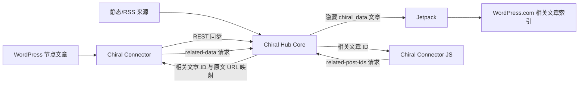

# Chiral Hub Core

[English](./README.md)

把一个 WordPress 站点变成 Chiral Network 的中心枢纽：一个面向独立博客的联邦制跨站相关文章网络。

Chiral Hub Core 是 WP Chiral Network 生态中的服务端 WordPress 插件。它接收来自节点站点的文章元数据，将这些数据保存为隐藏的 `chiral_data` 文章，让 Jetpack 把这些文章同步到 WordPress.com，并通过 REST 端点为 WordPress 节点和静态站客户端返回跨站相关文章。

项目理念来自 [WP Chiral Network 官网](https://ckc.akashio.com/)：独立博客应该可以建立属于自己和朋友的内容发现网络，而不是被迫依赖中心化内容平台。

## 生态位置

| 项目 | 角色 | 典型安装位置 |
| --- | --- | --- |
| Chiral Hub Core | 网络中心、文章元数据存储、Jetpack/WordPress.com 桥接层 | 负责运营网络的 WordPress 站点 |
| [Chiral Connector](https://github.com/Pls-1q43/Chiral-Connector) | 同步文章并展示相关文章的 WordPress 节点插件 | 成员 WordPress 博客 |
| [Chiral Connector JS](https://github.com/Pls-1q43/Chiral-Connector-JS) | 面向静态博客的仅展示客户端 | Hugo、Jekyll、Hexo、VuePress 等站点 |

## 功能

| 模块 | 能力 |
| --- | --- |
| 网络中心 | 将 WordPress 站点转换为可连接多个节点的 Chiral Hub。 |
| 数据模型 | 使用 `chiral_data` 自定义文章类型存储同步内容，并记录来源 URL、原始文章 ID、节点 ID、特色图 URL、标签、分类和同步元数据。 |
| 相关文章 | 依赖 Jetpack 与 WordPress.com 的相关文章能力，而不是在 Hub 服务器本地计算相似度。 |
| 节点访问 | 提供受限的 `chiral_porter` 角色，用于节点认证。 |
| REST API | 提供连接检查、相关文章数据查询和相关文章 ID 查询端点。 |
| 审核策略 | Hub 可以决定新同步内容是直接发布，还是先进入待审核状态。 |
| 静态来源 | 包含 RSS/Sitemap 抓取支持，用于非 WordPress 来源和 JS 客户端工作流。 |
| SEO 安全 | 让聚合的 `chiral_data` 不进入常规公开搜索流程，同时保留给相关文章索引使用。 |

## 环境要求

- WordPress 5.2 或更高版本。
- PHP 7.2 或更高版本。
- 已安装、启用并连接到 WordPress.com 的 Jetpack，且可以同步相关文章数据。
- 一个可被 Chiral Connector 或 JS 客户端访问的公开 Hub URL。

## 快速开始

1. 在负责运营网络的 WordPress 站点上安装 Chiral Hub Core。
2. 安装并连接 Jetpack，确认 Related Posts 模块可用。
3. 打开 WordPress 后台中的 Chiral Hub 菜单，设置网络名称、审核策略、默认相关文章数量，以及需要时的跳转模式。
4. 为每个 WordPress 节点创建或批准一个 `chiral_porter` 用户，设置唯一节点 ID，并为该用户生成 WordPress 应用程序密码。
5. 将 Hub URL、Porter 用户名和应用程序密码交给节点站管理员，用于配置 Chiral Connector。
6. 首次同步后检查 Hub 后台。同步内容应作为 `chiral_data` 文章出现，随后进入 Jetpack/WordPress.com 的相关文章匹配流程。

## REST API

插件提供以下主要端点：

| 端点 | 用途 |
| --- | --- |
| `/wp-json/wp/v2/chiral_data` | WordPress REST 中的 Chiral Data 同步文章 CRUD 接口。 |
| `/wp-json/chiral-network/v1/ping` | Chiral Connector 使用的认证连接检查。 |
| `/wp-json/chiral-network/v1/related-data` | WordPress 节点使用的认证相关文章查询。 |
| `/wp-json/chiral-network/v1/related-post-ids` | 静态 JS 客户端使用的公开/代理相关文章 ID 查询。 |

Connector 认证使用 WordPress 应用程序密码和 `chiral_porter` 角色。Hub 会在允许私有节点操作前验证节点身份。

## 数据与隐私模型

- 原始文章始终保留在来源站点。
- Hub 存储用于索引和推荐的文章元数据与内容，不获得对来源站点的控制权。
- Hub 上的管理操作只影响某个同步条目是否参与 Chiral Network，不会编辑节点站原始文章。
- 节点可以退出网络。对于 WordPress 节点，Chiral Connector 提供退出网络流程，会请求 Hub 删除节点数据。
- Hub 应通过 HTTPS 提供服务，因为凭据和同步元数据会通过 REST 请求传输。

## 发布与更新

当前插件版本为 `1.1.2`。

本仓库是插件内置更新检查器的发布源。更新检查器指向 `https://github.com/Pls-1q43/Chiral-Hub-Core/` 的 `main` 分支。发布可安装 ZIP 时，建议使用 GitHub Releases 或仓库归档。

## 故障排查

| 现象 | 检查项 |
| --- | --- |
| 没有相关文章 | Jetpack 可能仍在同步/索引，或网络内还没有足够的相关内容。 |
| Connector 无法连接 | 检查 Hub URL、Porter 用户名、应用程序密码、节点 ID，以及 HTTPS/API 可达性。 |
| 同步文章需要处理 | 检查 Hub 的内容审核策略，以及 `chiral_data` 是否处于待审核状态。 |
| 静态客户端找不到页面 | 确认 Hub 中存储的来源 URL 与静态页面请求的公开文章 URL 完全一致。 |
| 搜索引擎看到 Hub 数据 | 确认 Hub 运行当前插件版本，并且 `chiral_data` 已从公开搜索/索引流程中排除。 |

## 链接

- [WP Chiral Network](https://ckc.akashio.com/)
- [WP Chiral Network 工作原理](https://ckc.akashio.com/how-does-it-work/)
- [Chiral Connector](https://github.com/Pls-1q43/Chiral-Connector)
- [Chiral Connector JS](https://github.com/Pls-1q43/Chiral-Connector-JS)
- [作者博客](https://1q43.blog/)

## 许可证

GPL v3 或更高版本。详见 [GNU GPL v3 license](https://www.gnu.org/licenses/gpl-3.0.html)。
